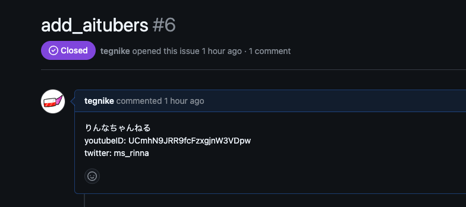
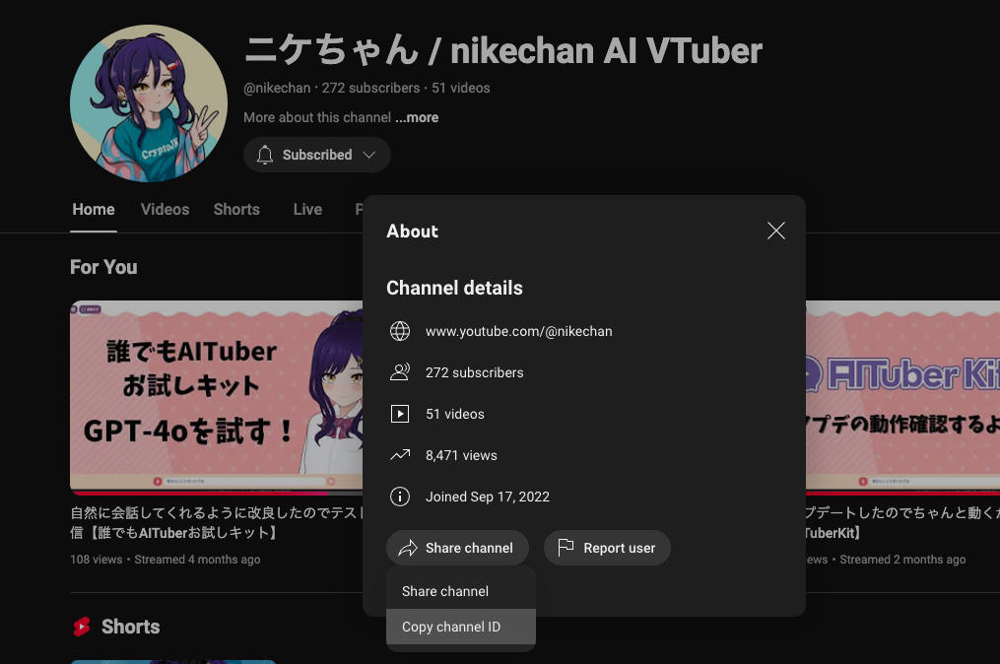

# AITuber List

https://tegnike.github.io/aituber-list/

## 概要

- このサイトは、AITuberの情報を集めるためのサイトです。
- 登録しているAITuberの情報は日本時間の9時と21時に更新されます。

## AITuber追加方法

### 1. Issueを作成

**add_aitubers** というタイトルでIssueを作成してください。



### 2. IssueにAITuberの情報を記入

下記を参考にIssueにAITuberの情報を記入してください。
自然言語で処理するので、決まったフォーマットはありません。以下の通りでなくても良いです。
また、複数のAITuberを同時に登録することもできるので、その場合はそれぞれのAITuberの情報をわかりやすく記入してください。

```
"name": 登録名,
"description": 説明,
"tags": タグ（フォーマット無し、複数可）,
"twitterID": twitterID,
"youtubeChannelID": youtubeチャンネルID,
```

このうち、**name**と**youtubeChannelID**は必須です。
youtubeChannelIDは下記を参考に取得してください。

1. 追加したいAITuberのチャンネルページにアクセス
2. 名前の下にある説明の more をクリック
3. 一番下の Share Channel => Copy Channel ID をクリック



### 3. Issueを送信

Issueを登録すると、自動的にサイトにAITuberの情報が追加されます。

